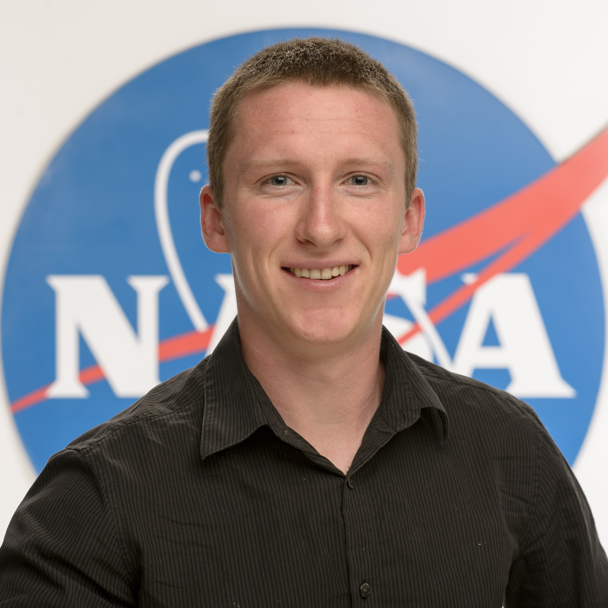

# **About Me**
I am a undergraduate student and researcher at MSU, striving to use data and 
machine learning to make the world a better place. I'm intereseted in 
sustainable energy, space, environment and how a furture of AI and machine 
learning will help us to tackle these issues.

## Research
In my undergraduate research in the Ecosystem Dynamics Lab, I have focused on
environmental modeling and climate research. Lately, I've been working on a
project to model streamflow and how it is effected by climate change in the
Greater Yellowstone Ecosystem.

## Resume
Check out my resume and connect with on [Linkedin](https://www.linkedin.com/in/jeradhoy).

## Personal
In my free time, I enjoy backpacking, skiing, paragliding and anything else in
the great outdoors.